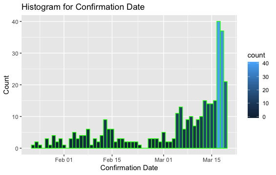

<link rel="stylesheet" href="./css/styles.css">

[BACK](./)

Reference:

1. [https://www.moh.gov.sg/covid-19](https://www.moh.gov.sg/covid-19)

## I. Background

1. CORONAVIRUS DISEASE 2019

1. Data source: SG MOH

<table>
  <tr>
    <th>CASE ID</th> <th>SEX</th> <th>AGE</th> <th>NATIONALITY</th> <th>CONFIRMED DATE</th> <th>HOSPITAL</th>
  </tr>
  <tr>
    <td>1</td> <td>MAN</td> <td>66</td> <td>Chinese national</td> <td>2020.01.23</td> <td>Singapore General Hospital (SGH)</td>
  </tr>
  <tr>
    <td>2</td> <td>WOMAN</td> <td>53</td> <td>Chinese national</td> <td>2020.01.24</td> <td>Tan Tock Seng Hospital (TTSH)</td>
  </tr>
  <tr>
    <td>3</td> <td>MAN</td> <td>37</td> <td>Chinese national</td> <td>2020.01.24</td> <td>Singapore General Hospital (SGH)</td>
  </tr>
  <tr>
    <td>4</td> <td>MAN</td> <td>36</td> <td>Chinese national</td> <td>2020.01.25</td> <td>Sengkang General Hospital (SKH)</td>
  </tr>
  <tr>
    <td>5</td> <td>WOMAN</td> <td>56</td> <td>Chinese national</td> <td>2020.01.27</td> <td>National Centre for Infectious Diseases (NCID)</td>
  </tr>
  <tr>
    <td>6</td> <td>MAN</td> <td>56</td> <td>Chinese national</td> <td>2020.01.27</td> <td>Changi General Hospital (CGH)</td>
  </tr>
  <tr>
    <td>7</td> <td>MAN</td> <td>35</td> <td>Chinese national</td> <td>2020.01.27</td> <td>National Centre for Infectious Diseases (NCID)</td>
  </tr>
  <tr>
    <td>8</td> <td>WOMAN</td> <td>56</td> <td>Chinese national</td> <td>2020.01.28</td> <td>National Centre for Infectious Diseases (NCID)</td>
  </tr>
  <tr>
    <td>9</td> <td>MAN</td> <td>56</td> <td>Chinese national</td> <td>2020.01.29</td> <td>National Centre for Infectious Diseases (NCID)</td>
  </tr>
  <tr>
    <td>10</td> <td>MAN</td> <td>56</td> <td>Chinese national</td> <td>2020.01.29</td> <td>National Centre for Infectious Diseases (NCID)</td>
  </tr>
  <tr>
    <td>11</td> <td>WOMAN</td> <td>31</td> <td>Chinese national</td> <td>2020.01.29</td> <td>National Centre for Infectious Diseases (NCID)</td>
  </tr>
  <tr>
    <td>12</td> <td>WOMAN</td> <td>37</td> <td>Chinese national</td> <td>2020.01.29</td> <td>National Centre for Infectious Diseases (NCID)</td>
  </tr>
  <tr>
    <td>13</td> <td>WOMAN</td> <td>73</td> <td>Chinese national</td> <td>2020.01.30</td> <td>National Centre for Infectious Diseases (NCID)</td>
  </tr>
  <tr>
    <td>14</td> <td>MAN</td> <td>31</td> <td>Chinese national</td> <td>2020.01.30</td> <td>National Centre for Infectious Diseases (NCID)</td>
  </tr>
  <tr>
    <td>15</td> <td>WOMAN</td> <td>47</td> <td>Singapore Citizen</td> <td>2020.01.31</td> <td>National Centre for Infectious Diseases (NCID)</td>
  </tr>
  <tr>
    <td>16</td> <td>MAN</td> <td>38</td> <td>Chinese national</td> <td>2020.01.31</td> <td>Singapore General Hospital (SGH)</td>
  </tr>
  <tr>
    <td>17</td> <td>WOMAN</td> <td>47</td> <td>Singapore Citizen</td> <td>2020.01.31</td> <td>National Centre for Infectious Diseases (NCID)</td>
  </tr>
  <tr>
    <td>18</td> <td>WOMAN</td> <td>31</td> <td>Chinese national</td> <td>2020.02.01</td> <td>National Centre for Infectious Diseases (NCID)</td>
  </tr>
  <tr>
    <td>19</td> <td>WOMAN</td> <td>28</td> <td>Singapore resident</td> <td>2020.02.03</td> <td>Singapore General Hospital (SGH)</td>
  </tr>
  <tr>
    <td>20</td> <td>WOMAN</td> <td>48</td> <td>Singapore resident</td> <td>2020.02.04</td> <td>National Centre for Infectious Diseases (NCID)</td>
  </tr>
  <tr>
    <td>21</td> <td>WOMAN</td> <td>44</td> <td>Indonesian national</td> <td>2020.02.04</td> <td>Singapore General Hospital (SGH)</td>
  </tr>
  <tr>
    <td>22</td> <td>MAN</td> <td>41</td> <td>Singapore Citizen</td> <td>2020.02.03</td> <td>National Centre for Infectious Diseases (NCID)</td>
  </tr>
  <tr>
    <td>23</td> <td>MAN</td> <td>17</td> <td>Singapore Citizen</td> <td>2020.02.03</td> <td>National Centre for Infectious Diseases (NCID)</td>
  </tr>
  <tr>
    <td>24</td> <td>WOMAN</td> <td>32</td> <td>Singapore Citizen</td> <td>2020.02.04</td> <td>National Centre for Infectious Diseases (NCID)</td>
  </tr>
  <tr>
    <td>25</td> <td>MAN</td> <td>40</td> <td>Singapore Citizen</td> <td>2020.02.04</td> <td>National Centre for Infectious Diseases (NCID)</td>
  </tr>
  <tr>
    <td>26</td> <td>WOMAN</td> <td>42</td> <td>Chinese national</td> <td>2020.02.04</td> <td>National Centre for Infectious Diseases (NCID)</td>
  </tr>
  <tr>
    <td>27</td> <td>MAN</td> <td>45</td> <td>Singapore Citizen</td> <td>2020.02.05</td> <td>National Centre for Infectious Diseases (NCID)</td>
  </tr>
  <tr>
    <td>28</td> <td>MAN</td> <td>0.5</td> <td>Singapore Citizen</td> <td>2020.02.05</td> <td>KK Women’s and Children’s Hospital (KKH)</td>
  </tr>
  <tr>
    <td>29</td> <td>MAN</td> <td>41</td> <td>Singapore Citizen</td> <td>2020.02.05</td> <td>National Centre for Infectious Diseases (NCID)</td>
  </tr>
  <tr>
    <td>30</td> <td>MAN</td> <td>27</td> <td>Singapore Citizen</td> <td>2020.02.06</td> <td>National Centre for Infectious Diseases (NCID)</td>
  </tr>
  <tr>
    <td>31</td> <td>MAN</td> <td>53</td> <td>Singapore Citizen</td> <td>2020.02.06</td> <td>Changi General Hospital (CGH)</td>
  </tr>
  <tr>
    <td>32</td> <td>WOMAN</td> <td>42</td> <td>Singapore Citizen</td> <td>2020.02.06</td> <td>National Centre for Infectious Diseases (NCID)</td>
  </tr>
  <tr>
    <td>33</td> <td>WOMAN</td> <td>39</td> <td>Singapore Citizen</td> <td>2020.02.06</td> <td>Sengkang General Hospital (SKH)</td>
  </tr>
  <tr>
    <td>34</td> <td>WOMAN</td> <td>40</td> <td>Singapore Citizen</td> <td>2020.02.07</td> <td>National Centre for Infectious Diseases (NCID)</td>
  </tr>
  <tr>
    <td>35</td> <td>MAN</td> <td>64</td> <td>Singapore Citizen</td> <td>2020.02.07</td> <td>Singapore General Hospital (SGH)</td>
  </tr>
  <tr>
    <td>36</td> <td>WOMAN</td> <td>38</td> <td>Singapore Permanent Resident</td> <td>2020.02.07</td> <td>National Centre for Infectious Diseases (NCID)</td>
  </tr>
  <tr>
    <td>37</td> <td>MAN</td> <td>53</td> <td>Singapore Citizen</td> <td>2020.02.07</td> <td>National Centre for Infectious Diseases (NCID)</td>
  </tr>
  <tr>
    <td>38</td> <td>WOMAN</td> <td>52</td> <td>Singapore Citizen</td> <td>2020.02.08</td> <td>National Centre for Infectious Diseases (NCID)</td>
  </tr>
  <tr>
    <td>39</td> <td>MAN</td> <td>51</td> <td>Singapore Citizen</td> <td>2020.02.08</td> <td>National Centre for Infectious Diseases (NCID)</td>
  </tr>
  <tr>
    <td>40</td> <td>MAN</td> <td>36</td> <td>Singapore Citizen</td> <td>2020.02.08</td> <td>National Centre for Infectious Diseases (NCID)</td>
  </tr>
  <tr>
    <td>41</td> <td>MAN</td> <td>71</td> <td>Singapore Citizen</td> <td>2020.02.08</td> <td>National Centre for Infectious Diseases (NCID)</td>
  </tr>
  <tr>
    <td>42</td> <td>MAN</td> <td>39</td> <td>Bangladesh national</td> <td>2020.02.08</td> <td>National Centre for Infectious Diseases (NCID)</td>
  </tr>
  <tr>
    <td>43</td> <td>MAN</td> <td>54</td> <td>Singapore Citizen</td> <td>2020.02.08</td> <td>Sengkang General Hospital (SKH)</td>
  </tr>
  <tr>
    <td>44</td> <td>MAN</td> <td>37</td> <td>Singapore Citizen</td> <td>2020.02.09</td> <td>Khoo Teck Puat Hospital (KTPH)</td>
  </tr>
  <tr>
    <td>45</td> <td>WOMAN</td> <td>2</td> <td>Singapore Citizen</td> <td>2020.02.10</td> <td>KK Women’s and Children’s Hospital (KKH)</td>
  </tr>
  <tr>
    <td>46</td> <td>MAN</td> <td>35</td> <td>Singapore Permanent Resident</td> <td>2020.02.10</td> <td>National Centre for Infectious Diseases (NCID)</td>
  </tr>
  <tr>
    <td>47</td> <td>MAN</td> <td>39</td> <td>Bangladesh national</td> <td>2020.02.10</td> <td>National Centre for Infectious Diseases (NCID)</td>
  </tr>
  <tr>
    <td>48</td> <td>MAN</td> <td>34</td> <td>Singapore Citizen</td> <td>2020.02.11</td> <td>National Centre for Infectious Diseases (NCID)</td>
  </tr>
  <tr>
    <td>49</td> <td>MAN</td> <td>46</td> <td>Singapore Citizen</td> <td>2020.02.11</td> <td>National University Hospital (NUH)</td>
  </tr>
  <tr>
    <td>50</td> <td>MAN</td> <td>62</td> <td>Singapore Citizen</td> <td>2020.02.12</td> <td>National Centre for Infectious Diseases (NCID)</td>
  </tr>
  <tr>
    <td>51</td> <td>MAN</td> <td>48</td> <td>Singapore Citizen</td> <td>2020.02.12</td> <td>National Centre for Infectious Diseases (NCID)</td>
  </tr>
  <tr>
    <td>52</td> <td>MAN</td> <td>37</td> <td>Bangladesh national</td> <td>2020.02.12</td> <td>National Centre for Infectious Diseases (NCID)</td>
  </tr>
  <tr>
    <td>53</td> <td>MAN</td> <td>54</td> <td>Singapore Citizen</td> <td>2020.02.12</td> <td>National Centre for Infectious Diseases (NCID)</td>
  </tr>
  <tr>
    <td>54</td> <td>WOMAN</td> <td>54</td> <td>Singapore Citizen</td> <td>2020.02.13</td> <td>National Centre for Infectious Diseases (NCID)</td>
  </tr>
  <tr>
    <td>55</td> <td>MAN</td> <td>30</td> <td>Singapore Citizen</td> <td>2020.02.13</td> <td>National Centre for Infectious Diseases (NCID)</td>
  </tr>
  <tr>
    <td>56</td> <td>MAN</td> <td>30</td> <td>Bangladesh national</td> <td>2020.02.13</td> <td>National Centre for Infectious Diseases (NCID)</td>
  </tr>
  <tr>
    <td>57</td> <td>MAN</td> <td>26</td> <td>Singapore Citizen</td> <td>2020.02.13</td> <td>National Centre for Infectious Diseases (NCID)</td>
  </tr>
  <tr>
    <td>58</td> <td>MAN</td> <td>55</td> <td>Singapore Citizen</td> <td>2020.02.13</td> <td>National Centre for Infectious Diseases (NCID)</td>
  </tr>
  <tr>
    <td>59</td> <td>MAN</td> <td>61</td> <td>Singapore Citizen</td> <td>2020.02.13</td> <td>National Centre for Infectious Diseases (NCID)</td>
  </tr>
  <tr>
    <td>60</td> <td>WOMAN</td> <td>51</td> <td>Singapore Citizen</td> <td>2020.02.13</td> <td>National Centre for Infectious Diseases (NCID)</td>
  </tr>
  <tr>
    <td>61</td> <td>MAN</td> <td>57</td> <td>Singapore Citizen</td> <td>2020.02.13</td> <td>National University Hospital (NUH)</td>
  </tr>
  <tr>
    <td>62</td> <td>WOMAN</td> <td>44</td> <td>Singapore Citizen</td> <td>2020.02.13</td> <td>Singapore General Hospital (SGH)</td>
  </tr>
  <tr>
    <td>63</td> <td>WOMAN</td> <td>54</td> <td>Singapore Citizen</td> <td>2020.02.14</td> <td>National Centre for Infectious Diseases (NCID)</td>
  </tr>
  <tr>
    <td>64</td> <td>MAN</td> <td>50</td> <td>Singapore Citizen</td> <td>2020.02.14</td> <td>National University Hospital (NUH)</td>
  </tr>
  <tr>
    <td>65</td> <td>WOMAN</td> <td>61</td> <td>Singapore Citizen</td> <td>2020.02.14</td> <td>National Centre for Infectious Diseases (NCID)</td>
  </tr>
  <tr>
    <td>66</td> <td>MAN</td> <td>28</td> <td>Singapore Citizen</td> <td>2020.02.14</td> <td>National Centre for Infectious Diseases (NCID)</td>
  </tr>
  <tr>
    <td>67</td> <td>WOMAN</td> <td>56</td> <td>Singapore Citizen</td> <td>2020.02.14</td> <td>National Centre for Infectious Diseases (NCID)</td>
  </tr>
  <tr>
    <td>68</td> <td>WOMAN</td> <td>79</td> <td>Singapore Citizen</td> <td>2020.02.14</td> <td>National Centre for Infectious Diseases (NCID)</td>
  </tr>
  <tr>
    <td>69</td> <td>MAN</td> <td>26</td> <td>Bangladesh national</td> <td>2020.02.15</td> <td>National Centre for Infectious Diseases (NCID)</td>
  </tr>
  <tr>
    <td>70</td> <td>WOMAN</td> <td>27</td> <td>Singapore Citizen</td> <td>2020.02.15</td> <td>National Centre for Infectious Diseases (NCID)</td>
  </tr>
  <tr>
    <td>71</td> <td>MAN</td> <td>25</td> <td>Singapore Citizen</td> <td>2020.02.15</td> <td>National Centre for Infectious Diseases (NCID)</td>
  </tr>
  <tr>
    <td>72</td> <td>MAN</td> <td>40</td> <td>Chinese national</td> <td>2020.02.15</td> <td>National Centre for Infectious Diseases (NCID)</td>
  </tr>
  <tr>
    <td>73</td> <td>MAN</td> <td>43</td> <td>Singapore Citizen</td> <td>2020.02.15</td> <td>National Centre for Infectious Diseases (NCID)</td>
  </tr>
  <tr>
    <td>74</td> <td>MAN</td> <td>29</td> <td>Singapore Citizen</td> <td>2020.02.15</td> <td>Alexandra Hospital (AH)</td>
  </tr>
  <tr>
    <td>75</td> <td>WOMAN</td> <td>71</td> <td>Singapore Citizen</td> <td>2020.02.16</td> <td>National Centre for Infectious Diseases (NCID)</td>
  </tr>
  <tr>
    <td>76</td> <td>MAN</td> <td>1</td> <td>Singapore Citizen</td> <td>2020.02.16</td> <td>KK Women’s and Children’s Hospital (KKH)</td>
  </tr>
  <tr>
    <td>77</td> <td>MAN</td> <td>35</td> <td>Singapore Citizen</td> <td>2020.02.17</td> <td>National Centre for Infectious Diseases (NCID)</td>
  </tr>
  <tr>
    <td>78</td> <td>WOMAN</td> <td>57</td> <td>Singapore Citizen</td> <td>2020.02.17</td> <td>National Centre for Infectious Diseases (NCID)</td>
  </tr>
  <tr>
    <td>79</td> <td>WOMAN</td> <td>35</td> <td>Malaysian national</td> <td>2020.02.17</td> <td>National Centre for Infectious Diseases (NCID)</td>
  </tr>
  <tr>
    <td>80</td> <td>WOMAN</td> <td>38</td> <td>Singapore Citizen</td> <td>2020.02.18</td> <td>National University Hospital (NUH)</td>
  </tr>
  <tr>
    <td>81</td> <td>MAN</td> <td>50</td> <td>Singapore Citizen</td> <td>2020.02.18</td> <td>National Centre for Infectious Diseases (NCID)</td>
  </tr>
  <tr>
    <td>82</td> <td>WOMAN</td> <td>57</td> <td>Singapore Citizen</td> <td>2020.02.18</td> <td>Ng Teng Fong General Hospital (NTFGH)</td>
  </tr>
  <tr>
    <td>83</td> <td>MAN</td> <td>54</td> <td>Singapore Citizen</td> <td>2020.02.19</td> <td>National Centre for Infectious Diseases (NCID)</td>
  </tr>
  <tr>
    <td>84</td> <td>WOMAN</td> <td>35</td> <td>Singapore Citizen</td> <td>2020.02.19</td> <td>National Centre for Infectious Diseases (NCID)</td>
  </tr>
  <tr>
    <td>85</td> <td>MAN</td> <td>36</td> <td>Chinese national</td> <td>2020.02.20</td> <td>National Centre for Infectious Diseases (NCID)</td>
  </tr>
  <tr>
    <td>86</td> <td>MAN</td> <td>24</td> <td>Singapore Citizen</td> <td>2020.02.20</td> <td>Ng Teng Fong General Hospital (NTFGH)</td>
  </tr>
  <tr>
    <td>87</td> <td>MAN</td> <td>32</td> <td>Singapore Citizen</td> <td>2020.02.21</td> <td>National Centre for Infectious Diseases (NCID)</td>
  </tr>
  <tr>
    <td>88</td> <td>WOMAN</td> <td>30</td> <td>Singapore Citizen</td> <td>2020.02.21</td> <td>National Centre for Infectious Diseases (NCID)</td>
  </tr>
  <tr>
    <td>89</td> <td>MAN</td> <td>41</td> <td>Singapore Permanent Resident</td> <td>2020.02.22</td> <td>National Centre for Infectious Diseases (NCID)</td>
  </tr>
  <tr>
    <td>90</td> <td>WOMAN</td> <td>75</td> <td>Singapore Citizen</td> <td>2020.02.23</td> <td>National Centre for Infectious Diseases (NCID)</td>
  </tr>
  <tr>
    <td>91</td> <td>WOMAN</td> <td>58</td> <td>Singapore Citizen</td> <td>2020.02.22</td> <td>National Centre for Infectious Diseases (NCID)</td>
  </tr>
  <tr>
    <td>92</td> <td>MAN</td> <td>47</td> <td>Singapore Citizen</td> <td>2020.02.26</td> <td>Sengkang General Hospital (SKH)</td>
  </tr>
  <tr>
    <td>93</td> <td>MAN</td> <td>38</td> <td>Singapore Citizen</td> <td>2020.02.26</td> <td>Ng Teng Fong General Hospital (NTFGH)</td>
  </tr>
  <tr>
    <td>94</td> <td>WOMAN</td> <td>64</td> <td>Singapore Citizen</td> <td>2020.02.26</td> <td>Singapore General Hospital (SGH)</td>
  </tr>
  <tr>
    <td>95</td> <td>MAN</td> <td>44</td> <td>Singapore Citizen</td> <td>2020.02.27</td> <td>National Centre for Infectious Diseases (NCID)</td>
  </tr>
  <tr>
    <td>96</td> <td>MAN</td> <td>12</td> <td>Singapore Citizen</td> <td>2020.02.27</td> <td>KK Women’s and Children’s Hospital (KKH)</td>
  </tr>
  <tr>
    <td>97</td> <td>WOMAN</td> <td>44</td> <td>Singapore Permanent Resident</td> <td>2020.02.27</td> <td>National Centre for Infectious Diseases (NCID)</td>
  </tr>
  <tr>
    <td>98</td> <td>MAN</td> <td>24</td> <td>Singapore Permanent Resident</td> <td>2020.02.28</td> <td>National Centre for Infectious Diseases (NCID)</td>
  </tr>
  <tr>
    <td>99</td> <td>MAN</td> <td>27</td> <td>Singapore Citizen</td> <td>2020.02.28</td> <td>National Centre for Infectious Diseases (NCID)</td>
  </tr>
  <tr>
    <td>100</td> <td>MAN</td> <td>20</td> <td>Malaysian national</td> <td>2020.02.28</td> <td>National Centre for Infectious Diseases (NCID)</td>
  </tr>
  <tr>
    <td>101</td> <td>MAN</td> <td>61</td> <td>Singapore Citizen</td> <td>2020.02.29</td> <td>Ng Teng Fong General Hospital (NTFGH)</td>
  </tr>
  <tr>
    <td>102</td> <td>WOMAN</td> <td>41</td> <td>Filipino national</td> <td>2020.02.29</td> <td>Ng Teng Fong General Hospital (NTFGH)</td>
  </tr>
  <tr>
    <td>103</td> <td>WOMAN</td> <td>37</td> <td>Singapore Citizen</td> <td>2020.03.01</td> <td>National Centre for Infectious Diseases (NCID)</td>
  </tr>
  <tr>
    <td>104</td> <td>WOMAN</td> <td>25</td> <td>Myanmar national</td> <td>2020.03.01</td> <td>National Centre for Infectious Diseases (NCID)</td>
  </tr>
  <tr>
    <td>105</td> <td>MAN</td> <td>49</td> <td>Singapore Citizen</td> <td>2020.03.01</td> <td>National Centre for Infectious Diseases (NCID)</td>
  </tr>
  <tr>
    <td>106</td> <td>MAN</td> <td>54</td> <td>Japanese national</td> <td>2020.03.01</td> <td>National Centre for Infectious Diseases (NCID)</td>
  </tr>
  <tr>
    <td>107</td> <td>WOMAN</td> <td>68</td> <td>Singapore Citizen</td> <td>2020.03.01</td> <td>National Centre for Infectious Diseases (NCID)</td>
  </tr>
  <tr>
    <td>108</td> <td>WOMAN</td> <td>34</td> <td>Filipino national</td> <td>2020.03.02</td> <td>Ng Teng Fong General Hospital (NTFGH)</td>
  </tr>
  <tr>
    <td>109</td> <td>MAN</td> <td>70</td> <td>Singapore Citizen</td> <td>2020.03.02</td> <td>Singapore General Hospital (SGH)</td>
  </tr>
  <tr>
    <td>110</td> <td>MAN</td> <td>33</td> <td>Singapore Citizen</td> <td>2020.03.03</td> <td>National Centre for Infectious Diseases (NCID)</td>
  </tr>
  <tr>
    <td>111</td> <td>MAN</td> <td>43</td> <td>Singapore Permanent Resident</td> <td>2020.03.03</td> <td>National University Hospital (NUH)</td>
  </tr>
  <tr>
    <td>112</td> <td>WOMAN</td> <td>62</td> <td>Singapore Citizen</td> <td>2020.03.04</td> <td>National Centre for Infectious Diseases (NCID)</td>
  </tr>
  <tr>
    <td>113</td> <td>MAN</td> <td>42</td> <td>French national</td> <td>2020.03.04</td> <td>National Centre for Infectious Diseases (NCID)</td>
  </tr>
  <tr>
    <td>114</td> <td>MAN</td> <td>62</td> <td>Singapore Citizen</td> <td>2020.03.04</td> <td>National University Hospital (NUH)</td>
  </tr>
  <tr>
    <td>115</td> <td>WOMAN</td> <td>62</td> <td>Singapore Citizen</td> <td>2020.03.05</td> <td>National University Hospital (NUH)</td>
  </tr>
  <tr>
    <td>116</td> <td>WOMAN</td> <td>50</td> <td>Singapore Citizen</td> <td>2020.03.05</td> <td>National Centre for Infectious Diseases (NCID)</td>
  </tr>
  <tr>
    <td>117</td> <td>WOMAN</td> <td>52</td> <td>Singapore Citizen</td> <td>2020.03.05</td> <td>National Centre for Infectious Diseases (NCID)</td>
  </tr>
  <tr>
    <td>118</td> <td>WOMAN</td> <td>33</td> <td>Singapore Citizen</td> <td>2020.03.05</td> <td>National University Hospital (NUH)</td>
  </tr>
  <tr>
    <td>119</td> <td>MAN</td> <td>55</td> <td>Singapore Citizen</td> <td>2020.03.05</td> <td>Alexandra Hospital (AH)</td>
  </tr>
  <tr>
    <td>120</td> <td>WOMAN</td> <td>62</td> <td>Singapore Citizen</td> <td>2020.03.05</td> <td>National Centre for Infectious Diseases (NCID)</td>
  </tr>
  <tr>
    <td>121</td> <td>WOMAN</td> <td>54</td> <td>Singapore Citizen</td> <td>2020.03.05</td> <td>National Centre for Infectious Diseases (NCID)</td>
  </tr>
  <tr>
    <td>122</td> <td>WOMAN</td> <td>64</td> <td>Singapore Citizen</td> <td>2020.03.05</td> <td>National Centre for Infectious Diseases (NCID)</td>
  </tr>
  <tr>
    <td>123</td> <td>MAN</td> <td>47</td> <td>Singapore Citizen</td> <td>2020.03.05</td> <td>Sengkang General Hospital (SKH)</td>
  </tr>
  <tr>
    <td>124</td> <td>WOMAN</td> <td>37</td> <td>Singapore Permanent Resident</td> <td>2020.03.06</td> <td>National Centre for Infectious Diseases (NCID)</td>
  </tr>
  <tr>
    <td>125</td> <td>WOMAN</td> <td>65</td> <td>Singapore Citizen</td> <td>2020.03.06</td> <td>National Centre for Infectious Diseases (NCID)</td>
  </tr>
  <tr>
    <td>126</td> <td>MAN</td> <td>77</td> <td>Singapore Citizen</td> <td>2020.03.05</td> <td>National Centre for Infectious Diseases (NCID)</td>
  </tr>
  <tr>
    <td>127</td> <td>WOMAN</td> <td>64</td> <td>Singapore Citizen</td> <td>2020.03.05</td> <td>National Centre for Infectious Diseases (NCID)</td>
  </tr>
  <tr>
    <td>128</td> <td>MAN</td> <td>70</td> <td>Singapore Citizen</td> <td>2020.03.06</td> <td>National Centre for Infectious Diseases (NCID)</td>
  </tr>
  <tr>
    <td>129</td> <td>WOMAN</td> <td>68</td> <td>Singapore Citizen</td> <td>2020.03.06</td> <td>Ng Teng Fong General Hospital (NTFGH)</td>
  </tr>
  <tr>
    <td>130</td> <td>MAN</td> <td>66</td> <td>Singapore Citizen</td> <td>2020.03.06</td> <td>Ng Teng Fong General Hospital (NTFGH)</td>
  </tr>
  <tr>
    <td>131</td> <td>MAN</td> <td>66</td> <td>Singapore Citizen</td> <td>2020.03.06</td> <td>Ng Teng Fong General Hospital (NTFGH)</td>
  </tr>
  <tr>
    <td>132</td> <td>WOMAN</td> <td>37</td> <td>Singapore Permanent Resident</td> <td>2020.03.06</td> <td>National University Hospital (NUH)</td>
  </tr>
  <tr>
    <td>133</td> <td>WOMAN</td> <td>62</td> <td>Indonesian national</td> <td>2020.03.06</td> <td>National University Hospital (NUH)</td>
  </tr>
  <tr>
    <td>134</td> <td>WOMAN</td> <td>56</td> <td>Singapore Citizen</td> <td>2020.03.06</td> <td>National Centre for Infectious Diseases (NCID)</td>
  </tr>
  <tr>
    <td>135</td> <td>MAN</td> <td>40</td> <td>Singapore Citizen</td> <td>2020.03.06</td> <td>Singapore General Hospital (SGH)</td>
  </tr>
  <tr>
    <td>136</td> <td>MAN</td> <td>36</td> <td>Italian national</td> <td>2020.03.06</td> <td>National Centre for Infectious Diseases (NCID)</td>
  </tr>
  <tr>
    <td>137</td> <td>MAN</td> <td>60</td> <td>Singapore Citizen</td> <td>2020.03.06</td> <td>National Centre for Infectious Diseases (NCID)</td>
  </tr>
  <tr>
    <td>138</td> <td>MAN</td> <td>26</td> <td>Singapore Citizen</td> <td>2020.03.06</td> <td>National Centre for Infectious Diseases (NCID)</td>
  </tr>
  <tr>
    <td>139</td> <td>MAN</td> <td>71</td> <td>Singapore Citizen</td> <td>2020.03.07</td> <td>Ng Teng Fong General Hospital (NTFGH)</td>
  </tr>
  <tr>
    <td>140</td> <td>WOMAN</td> <td>62</td> <td>Singapore Citizen</td> <td>2020.03.07</td> <td>Ng Teng Fong General Hospital (NTFGH)</td>
  </tr>
  <tr>
    <td>141</td> <td>MAN</td> <td>69</td> <td>Singapore Citizen</td> <td>2020.03.07</td> <td>Ng Teng Fong General Hospital (NTFGH)</td>
  </tr>
  <tr>
    <td>142</td> <td>MAN</td> <td>26</td> <td>Singapore Citizen</td> <td>2020.03.07</td> <td>Ng Teng Fong General Hospital (NTFGH)</td>
  </tr>
  <tr>
    <td>143</td> <td>MAN</td> <td>42</td> <td>Singapore Permanent Resident</td> <td>2020.03.07</td> <td>National University Hospital (NUH)</td>
  </tr>
  <tr>
    <td>144</td> <td>WOMAN</td> <td>58</td> <td>Singapore Citizen</td> <td>2020.03.07</td> <td>Ng Teng Fong General Hospital (NTFGH)</td>
  </tr>
  <tr>
    <td>145</td> <td>WOMAN</td> <td>67</td> <td>Singapore Citizen</td> <td>2020.03.08</td> <td>National Centre for Infectious Diseases (NCID)</td>
  </tr>
  <tr>
    <td>146</td> <td>WOMAN</td> <td>64</td> <td>Singapore Citizen</td> <td>2020.03.08</td> <td>National Centre for Infectious Diseases (NCID)</td>
  </tr>
  <tr>
    <td>147</td> <td>MAN</td> <td>64</td> <td>Indonesian national</td> <td>2020.03.08</td> <td>National Centre for Infectious Diseases (NCID)</td>
  </tr>
  <tr>
    <td>148</td> <td>WOMAN</td> <td>67</td> <td>Singapore Citizen</td> <td>2020.03.08</td> <td>National Centre for Infectious Diseases (NCID)</td>
  </tr>
  <tr>
    <td>149</td> <td>MAN</td> <td>62</td> <td>Singapore Citizen</td> <td>2020.03.08</td> <td>National Centre for Infectious Diseases (NCID)</td>
  </tr>
  <tr>
    <td>150</td> <td>WOMAN</td> <td>53</td> <td>Singapore Permanent Resident</td> <td>2020.03.08</td> <td>National Centre for Infectious Diseases (NCID)</td>
  </tr>
  <tr>
    <td>151</td> <td>MAN</td> <td>51</td> <td>Singapore Citizen</td> <td>2020.03.08</td> <td>National Centre for Infectious Diseases (NCID)</td>
  </tr>
  <tr>
    <td>152</td> <td>MAN</td> <td>65</td> <td>Indonesian national</td> <td>2020.03.08</td> <td>Singapore General Hospital (SGH)</td>
  </tr>
  <tr>
    <td>153</td> <td>WOMAN</td> <td>65</td> <td>Singapore Citizen</td> <td>2020.03.08</td> <td>Singapore General Hospital (SGH)</td>
  </tr>
  <tr>
    <td>154</td> <td>MAN</td> <td>52</td> <td>British national</td> <td>2020.03.09</td> <td>National Centre for Infectious Diseases (NCID)</td>
  </tr>
  <tr>
    <td>155</td> <td>WOMAN</td> <td>47</td> <td>Malaysian national</td> <td>2020.03.09</td> <td>National Centre for Infectious Diseases (NCID)</td>
  </tr>
  <tr>
    <td>156</td> <td>WOMAN</td> <td>50</td> <td>Singapore Permanent Resident</td> <td>2020.03.09</td> <td>National Centre for Infectious Diseases (NCID)</td>
  </tr>
  <tr>
    <td>157</td> <td>WOMAN</td> <td>54</td> <td>Singapore Permanent Resident</td> <td>2020.03.09</td> <td>National Centre for Infectious Diseases (NCID)</td>
  </tr>
  <tr>
    <td>158</td> <td>WOMAN</td> <td>53</td> <td>Singapore Citizen</td> <td>2020.03.09</td> <td>Ng Teng Fong General Hospital (NTFGH)</td>
  </tr>
  <tr>
    <td>159</td> <td>MAN</td> <td>59</td> <td>Singapore Citizen</td> <td>2020.03.09</td> <td>Ng Teng Fong General Hospital (NTFGH)</td>
  </tr>
  <tr>
    <td>160</td> <td>MAN</td> <td>5</td> <td>Singapore Citizen</td> <td>2020.03.09</td> <td>KK Women’s and Children’s Hospital (KKH)</td>
  </tr>
  <tr>
    <td>161</td> <td>MAN</td> <td>73</td> <td>Singapore Citizen</td> <td>2020.03.09</td> <td>National Centre for Infectious Diseases (NCID)</td>
  </tr>
  <tr>
    <td>162</td> <td>MAN</td> <td>28</td> <td>Singapore Citizen</td> <td>2020.03.09</td> <td>National Centre for Infectious Diseases (NCID)</td>
  </tr>
  <tr>
    <td>163</td> <td>WOMAN</td> <td>27</td> <td>Singapore Citizen</td> <td>2020.03.09</td> <td>National Centre for Infectious Diseases (NCID)</td>
  </tr>
  <tr>
    <td>164</td> <td>WOMAN</td> <td>57</td> <td>Singapore Permanent Resident</td> <td>2020.03.10</td> <td>National Centre for Infectious Diseases (NCID)</td>
  </tr>
  <tr>
    <td>165</td> <td>MAN</td> <td>30</td> <td>Singapore Citizen</td> <td>2020.03.10</td> <td>National Centre for Infectious Diseases (NCID)</td>
  </tr>
  <tr>
    <td>166</td> <td>WOMAN</td> <td>55</td> <td>Singapore Citizen</td> <td>2020.03.10</td> <td>Ng Teng Fong General Hospital (NTFGH)</td>
  </tr>
  <tr>
    <td>167</td> <td>WOMAN</td> <td>35</td> <td>Filipino national</td> <td>2020.03.10</td> <td>Ng Teng Fong General Hospital (NTFGH)</td>
  </tr>
  <tr>
    <td>168</td> <td>MAN</td> <td>47</td> <td>Singapore Citizen</td> <td>2020.03.10</td> <td>Sengkang General Hospital (SKH)</td>
  </tr>
  <tr>
    <td>169</td> <td>MAN</td> <td>40</td> <td>Singapore Citizen</td> <td>2020.03.10</td> <td>Khoo Teck Puat Hospital (KTPH)</td>
  </tr>
  <tr>
    <td>170</td> <td>WOMAN</td> <td>56</td> <td>Indonesian national</td> <td>2020.03.10</td> <td>Singapore General Hospital (SGH)</td>
  </tr>
  <tr>
    <td>171</td> <td>MAN</td> <td>27</td> <td>Singapore Citizen</td> <td>2020.03.11</td> <td>National Centre for Infectious Diseases (NCID)</td>
  </tr>
  <tr>
    <td>172</td> <td>WOMAN</td> <td>42</td> <td>Filipino national</td> <td>2020.03.11</td> <td>National Centre for Infectious Diseases (NCID)</td>
  </tr>
  <tr>
    <td>173</td> <td>MAN</td> <td>31</td> <td>Singapore Citizen</td> <td>2020.03.11</td> <td>National Centre for Infectious Diseases (NCID)</td>
  </tr>
  <tr>
    <td>174</td> <td>WOMAN</td> <td>67</td> <td>Singapore Citizen</td> <td>2020.03.11</td> <td>National Centre for Infectious Diseases (NCID)</td>
  </tr>
  <tr>
    <td>175</td> <td>MAN</td> <td>44</td> <td>Singapore Citizen</td> <td>2020.03.11</td> <td>National Centre for Infectious Diseases (NCID)</td>
  </tr>
  <tr>
    <td>176</td> <td>WOMAN</td> <td>37</td> <td>British national</td> <td>2020.03.11</td> <td>National Centre for Infectious Diseases (NCID)</td>
  </tr>
  <tr>
    <td>177</td> <td>MAN</td> <td>26</td> <td>Singapore Citizen</td> <td>2020.03.11</td> <td>National Centre for Infectious Diseases (NCID)</td>
  </tr>
  <tr>
    <td>178</td> <td>MAN</td> <td>37</td> <td>Filipino national</td> <td>2020.03.11</td> <td>Ng Teng Fong General Hospital (NTFGH)</td>
  </tr>
  <tr>
    <td>179</td> <td>WOMAN</td> <td>66</td> <td>Singapore Citizen</td> <td>2020.03.11</td> <td>National University Hospital (NUH)</td>
  </tr>
  <tr>
    <td>180</td> <td>MAN</td> <td>71</td> <td>Singapore Citizen</td> <td>2020.03.12</td> <td>National Centre for Infectious Diseases (NCID)</td>
  </tr>
  <tr>
    <td>181</td> <td>MAN</td> <td>83</td> <td>Indonesian national</td> <td>2020.03.12</td> <td>Gleneagles Hospital (GH)</td>
  </tr>
  <tr>
    <td>182</td> <td>WOMAN</td> <td>76</td> <td>Indonesian national</td> <td>2020.03.12</td> <td>Gleneagles Hospital (GH)</td>
  </tr>
  <tr>
    <td>183</td> <td>MAN</td> <td>29</td> <td>Singapore Citizen</td> <td>2020.03.12</td> <td>National Centre for Infectious Diseases (NCID)</td>
  </tr>
  <tr>
    <td>184</td> <td>MAN</td> <td>35</td> <td>Filipino national</td> <td>2020.03.12</td> <td>National Centre for Infectious Diseases (NCID)</td>
  </tr>
  <tr>
    <td>185</td> <td>MAN</td> <td>34</td> <td>Singapore Citizen</td> <td>2020.03.12</td> <td>National Centre for Infectious Diseases (NCID)</td>
  </tr>
  <tr>
    <td>186</td> <td>MAN</td> <td>64</td> <td>Singapore Citizen</td> <td>2020.03.12</td> <td>National Centre for Infectious Diseases (NCID)</td>
  </tr>
  <tr>
    <td>187</td> <td>MAN</td> <td>48</td> <td>Singapore Citizen</td> <td>2020.03.12</td> <td>National Centre for Infectious Diseases (NCID)</td>
  </tr>
  <tr>
    <td>188</td> <td>MAN</td> <td>53</td> <td>Singapore Citizen</td> <td>2020.03.12</td> <td>Khoo Teck Puat Hospital (KTPH)</td>
  </tr>
  <tr>
    <td>189</td> <td>MAN</td> <td>36</td> <td>Indian national</td> <td>2020.03.12</td> <td>National Centre for Infectious Diseases (NCID)</td>
  </tr>
  <tr>
    <td>190</td> <td>MAN</td> <td>53</td> <td>Singapore Citizen</td> <td>2020.03.13</td> <td>National Centre for Infectious Diseases (NCID)</td>
  </tr>
  <tr>
    <td>191</td> <td>WOMAN</td> <td>24</td> <td>Malaysian national</td> <td>2020.03.13</td> <td>National Centre for Infectious Diseases (NCID)</td>
  </tr>
  <tr>
    <td>192</td> <td>MAN</td> <td>32</td> <td>American national</td> <td>2020.03.13</td> <td>National Centre for Infectious Diseases (NCID)</td>
  </tr>
  <tr>
    <td>193</td> <td>MAN</td> <td>26</td> <td>Malaysian national</td> <td>2020.03.13</td> <td>National Centre for Infectious Diseases (NCID)</td>
  </tr>
  <tr>
    <td>194</td> <td>WOMAN</td> <td>24</td> <td>Chinese national</td> <td>2020.03.13</td> <td>National Centre for Infectious Diseases (NCID)</td>
  </tr>
  <tr>
    <td>195</td> <td>MAN</td> <td>47</td> <td>Singapore Citizen</td> <td>2020.03.13</td> <td>National Centre for Infectious Diseases (NCID)</td>
  </tr>
  <tr>
    <td>196</td> <td>WOMAN</td> <td>73</td> <td>Singapore Citizen</td> <td>2020.03.13</td> <td>National Centre for Infectious Diseases (NCID)</td>
  </tr>
  <tr>
    <td>197</td> <td>MAN</td> <td>30</td> <td>Singapore Citizen</td> <td>2020.03.13</td> <td>National Centre for Infectious Diseases (NCID)</td>
  </tr>
  <tr>
    <td>198</td> <td>WOMAN</td> <td>61</td> <td>Singapore Citizen</td> <td>2020.03.13</td> <td>National Centre for Infectious Diseases (NCID)</td>
  </tr>
  <tr>
    <td>199</td> <td>MAN</td> <td>37</td> <td>Singapore Citizen</td> <td>2020.03.13</td> <td>National Centre for Infectious Diseases (NCID)</td>
  </tr>
  <tr>
    <td>200</td> <td>WOMAN</td> <td>62</td> <td>Singapore Citizen</td> <td>2020.03.13</td> <td>National Centre for Infectious Diseases (NCID)</td>
  </tr>
  <tr>
    <td>201</td> <td>WOMAN</td> <td>52</td> <td>Singapore Citizen</td> <td>2020.03.13</td> <td>Ng Teng Fong General Hospital (NTFGH)</td>
  </tr>
  <tr>
    <td>202</td> <td>MAN</td> <td>44</td> <td>Singapore Citizen</td> <td>2020.03.13</td> <td>Sengkang General Hospital (SKH)</td>
  </tr>
  <tr>
    <td>203</td> <td>WOMAN</td> <td>36</td> <td>Singapore Citizen</td> <td>2020.03.13</td> <td>Changi General Hospital (CGH)</td>
  </tr>
  <tr>
    <td>204</td> <td>MAN</td> <td>32</td> <td>American national</td> <td>2020.03.13</td> <td>Singapore General Hospital (SGH)</td>
  </tr>
  <tr>
    <td>205</td> <td>WOMAN</td> <td>30</td> <td>Filipino national</td> <td>2020.03.14</td> <td>National Centre for Infectious Diseases (NCID)</td>
  </tr>
  <tr>
    <td>206</td> <td>WOMAN</td> <td>33</td> <td>New Zealand national</td> <td>2020.03.14</td> <td>National Centre for Infectious Diseases (NCID)</td>
  </tr>
  <tr>
    <td>207</td> <td>WOMAN</td> <td>40</td> <td>Singapore Citizen</td> <td>2020.03.14</td> <td>National Centre for Infectious Diseases (NCID)</td>
  </tr>
  <tr>
    <td>208</td> <td>WOMAN</td> <td>26</td> <td>Singapore Citizen</td> <td>2020.03.14</td> <td>National Centre for Infectious Diseases (NCID)</td>
  </tr>
  <tr>
    <td>209</td> <td>WOMAN</td> <td>32</td> <td>Singapore Citizen</td> <td>2020.03.14</td> <td>Singapore General Hospital’s (SGH)</td>
  </tr>
  <tr>
    <td>210</td> <td>MAN</td> <td>56</td> <td>German national</td> <td>2020.03.14</td> <td>National Centre for Infectious Diseases (NCID)</td>
  </tr>
  <tr>
    <td>211</td> <td>WOMAN</td> <td>35</td> <td>Filipino national</td> <td>2020.03.14</td> <td>National Centre for Infectious Diseases (NCID)</td>
  </tr>
  <tr>
    <td>212</td> <td>MAN</td> <td>64</td> <td>Indonesian national</td> <td>2020.03.14</td> <td>National Centre for Infectious Diseases (NCID)</td>
  </tr>
  <tr>
    <td>213</td> <td>MAN</td> <td>48</td> <td>Singapore Citizen</td> <td>2020.03.14</td> <td>Sengkang General Hospital (SKH)</td>
  </tr>
  <tr>
    <td>214</td> <td>MAN</td> <td>29</td> <td>Singapore Citizen</td> <td>2020.03.14</td> <td>National Centre for Infectious Diseases (NCID)</td>
  </tr>
  <tr>
    <td>215</td> <td>MAN</td> <td>65</td> <td>Singapore Citizen</td> <td>2020.03.14</td> <td>Singapore General Hospital (SGH)</td>
  </tr>
  <tr>
    <td>216</td> <td>MAN</td> <td>30</td> <td>Singapore Citizen</td> <td>2020.03.14</td> <td>National Centre for Infectious Diseases (NCID)</td>
  </tr>
  <tr>
    <td>217</td> <td>MAN</td> <td>22</td> <td>Spanish national</td> <td>2020.03.14</td> <td>National Centre for Infectious Diseases (NCID)</td>
  </tr>
  <tr>
    <td>218</td> <td>WOMAN</td> <td>55</td> <td>Singapore Citizen</td> <td>2020.03.14</td> <td>National University Hospital (NUH)</td>
  </tr>
  <tr>
    <td>219</td> <td>MAN</td> <td>30</td> <td>Singapore Citizen</td> <td>2020.03.15</td> <td>Sengkang General Hospital (SKH)</td>
  </tr>
  <tr>
    <td>220</td> <td>MAN</td> <td>53</td> <td>Singapore Permanent Resident</td> <td>2020.03.15</td> <td>National Centre for Infectious Diseases (NCID)</td>
  </tr>
  <tr>
    <td>221</td> <td>WOMAN</td> <td>28</td> <td>Filipino national</td> <td>2020.03.15</td> <td>National Centre for Infectious Diseases (NCID)</td>
  </tr>
  <tr>
    <td>222</td> <td>MAN</td> <td>41</td> <td>French national</td> <td>2020.03.15</td> <td>National Centre for Infectious Diseases (NCID)</td>
  </tr>
  <tr>
    <td>223</td> <td>MAN</td> <td>60</td> <td>Singapore Citizen</td> <td>2020.03.15</td> <td>National Centre for Infectious Diseases (NCID)</td>
  </tr>
  <tr>
    <td>224</td> <td>MAN</td> <td>50</td> <td>Singapore Citizen</td> <td>2020.03.15</td> <td>National Centre for Infectious Diseases (NCID)</td>
  </tr>
  <tr>
    <td>225</td> <td>MAN</td> <td>63</td> <td>Singapore Citizen</td> <td>2020.03.15</td> <td>National Centre for Infectious Diseases (NCID)</td>
  </tr>
  <tr>
    <td>226</td> <td>MAN</td> <td>49</td> <td>Dutch national</td> <td>2020.03.15</td> <td>National Centre for Infectious Diseases (NCID)</td>
  </tr>
  <tr>
    <td></td> <td></td> <td></td> <td></td> <td></td> <td></td>
  </tr>
</table>

1. Variables
```
National Centre for Infectious Diseases (NCID)
KK Women’s and Children’s Hospital (KKH)
Ng Teng Fong General Hospital (NTFGH)
Singapore General Hospital (SGH)
Sengkang General Hospital (SKH)
National University Hospital (NUH)
Gleneagles Hospital (GH)
Khoo Teck Puat Hospital (KTPH)
```
```
Singapore Citizen
Indonesian national
British national
Malaysian national
Singapore Permanent Resident
Filipino national
Chinese national
Dutch national
German national
Spanish national
French national
New Zealand national
American national
```


1. Objects and measurement:
```
(1) Analyze what is the relationship amoung these confirmed cases.
(2) Analyze the trends.
```

## II. Data Analysis

### 1. Import Data and view

#### 1.1 Import data

#### 1.2 Network Diagram
```
Network diagrams (or Graphs) show interconnections between a set of entities. Each entity is represented by a Node (or vertice). Connections between nodes are represented by links (or edges). 
Three packages are of interest in R: 
1. igraph for data preparation and plotting, 
2. ggraph for plotting using the grammar of graphic, and 
3. networkD3 for interactivity.
```
##### 1.2.1 igraph

```
1. LCM: The Life Church and Missions Singapore
2. GAG: The Grace Assembly of God
3. YTH: Yong Thai Hang
4. GHS: Grand Hyatt Singapore
5. SAH: The Seletar Aerospace Heights construction site
6. WTP: Wizlearn Technologies Pte Ltd
7. SAFRA: SAFRA Jurong
```
##### 1.2.2 ggplot
```
library(readr)
sg <- read_csv("COVID-19_SG.csv")

library(ggplot2)
c <- ggplot(sg, aes(sg$DateOfConfirmation))
c + geom_histogram(binwidth = 1, col="green", aes(fill=..count..)) +
      labs(title="Histogram for Confirmation Date") +
      labs(x="Confirmation Date", y="Count")
```


[BACK](./)
