[BACK](./)

Reference:

1. [https://chf2012.github.io/2017/01/30/数据分析/20_数据分析/专题分析/优秀员工离职原因分析与预测/](https://chf2012.github.io/2017/01/30/数据分析/20_数据分析/专题分析/优秀员工离职原因分析与预测/)
2. [https://blog.csdn.net/qq_20408903/article/details/80628331](https://blog.csdn.net/qq_20408903/article/details/80628331)
3. [https://blog.csdn.net/wanglingli95/article/details/79435976](https://blog.csdn.net/wanglingli95/article/details/79435976)
4. [https://blog.csdn.net/Cocaine_bai/article/details/80749588](https://blog.csdn.net/Cocaine_bai/article/details/80749588)
5. [https://blog.csdn.net/Cocaine_bai/article/details/80758636](https://blog.csdn.net/Cocaine_bai/article/details/80758636)

## I. Background

1. Plenty of excellent and experienced employee resign ahead of expected.

1. Data source: kaggle

1. Variables
```
satisfaction: employee satisfaction level
evaluation: last evaluation
project: number of projects
hours: average monthly hours
years: time spent at the company
accident: whether they have had a work accident
promotion: whether they have had a promotion in the last 5 years
sales: department
salary: salary
left: whether the employee has left
```

1. Objects and measurement:
```
(1) Analyze what is the possible reasons the employee resign
(2) Build the predicting model and predict which excellent employee will be the next to resign
```

## II. Data Analysis

Libraries
```
library(readr)
library(dplyr)
library(ggplot2)
library(gmodels)
```

### 1. Import Data and view

1.1 Import data
```
hr <- read_csv("HR_comma_sep.csv")
hr <- tbl_df(hr)
View(hr)
str(hr)
```


1.2 Rename variables
```
colnames(hr) <- c("satisfaction", "evaluation", "project", "hours", "years", "accident", "left", "promotion", "sales", "salary")
```

1.3 Factor
```
hr$sales <- factor(hr$sales)
hr$salary <- factor(hr$salary, levels=c("low", "medium", "high"))
```

1.4 View data
```
sum(is.na(hr))
```
#[1] 0

```
summary(hr)
```


### 2. Based on assumption, choose the subset of excellent employees
Excellent employee:
```
(1) evaludation >= 0.75
(2) project >= 4
(3) year >= 4
```

2.1 filter subset based on assumption
```
hr_good <- filter(hr, evaluation>=0.75 & years>=4 & project>=4)
```

2.2 Compare left employee from subset with overall
```
CrossTable(hr$left)
```


```
CrossTable(hr_good$left)
```


Conclusion:
```
(1) from overall left employees, excellent employee percentage = 1778/3571 = 50%
(2) from excellent employees subset, the left percentage = 1778/2763 = 64%
```

2.3 view excellent employee subset
```
summary(hr_good)
```


2.4 View the correlationship among the variables in excellent employees subset
```
library("corrplot")
hr_good_corr <- select(hr, -sales, -salary) %>% cor()
corrplot(hr_good_corr, method="circle", tl.col="black", title="Left and Satisfaction", mar=c(1,1,3,1))
```


Conclusion:
```
(1) Left has negative correlationship with satisfaction, and high correlated.
```
### 3. View the relationship among employee left, satisfaction and other variables 

3.1 View satisfaction distribution
```
library("corrplot")
hr_good$left <- factor(hr_good$left, levels=c(0,1), labels=c("stay", "left"))
ggplot(hr_good, aes(satisfaction, fill=left)) + geom_histogram(position="dodge") + scale_x_continuous(breaks=c(0.1, 0.13, 0.25, 0.50, 0.73, 0.75, 0.92, 1.00))+theme(axis.text.x=element_text(angle=90))+labs(title="satisfaction distribution")
```
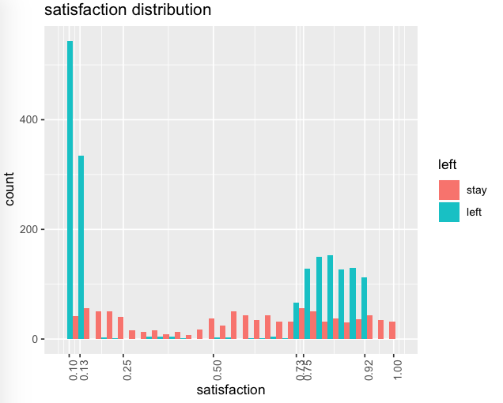
3.2 View the relationship among salary, working hours, satisfaction and left
```
ggplot(hr_good, aes(salary, hours, alpha=satisfaction, color=left))+geom_jitter() + theme3 +labs(title=paste("Relationship among salary, working hours, satisfaction and left"))
```
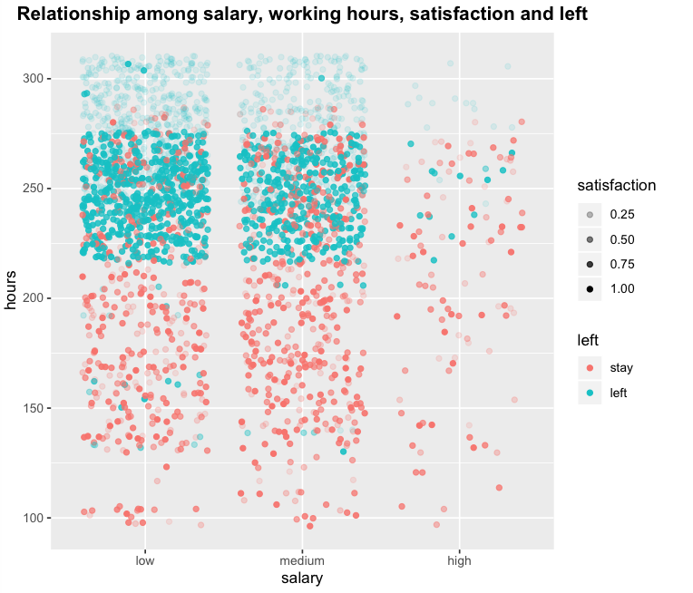
Conclusion:
```
(1)
(2)
(3)
```
3.3 View the relationship among promotion, evaluation and left
```
ggplot(hr_good, aes(promotion, evaluation, color=left))+geom_jitter()+theme3+scale_x_discrete(limits=c(0,1))+labs(title=paste("Relationship among promotion, evaluation and left"))
```
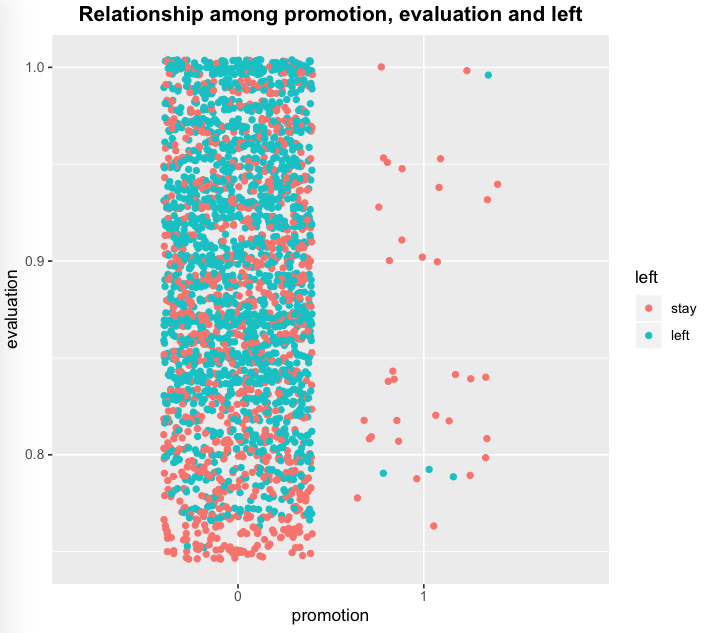
Conclusion:
```
(1)
```
3.4 View the relationship among working years, satisfaction and left
```
ggplot(hr_good, aes(years, satisfaction, color=left))+geom_jitter()+scale_x_discrete(limits=c(4,5,6,7,8,9,10))+theme3+labs(title=paste("Relationship among working years, satisfaction and left"))
```
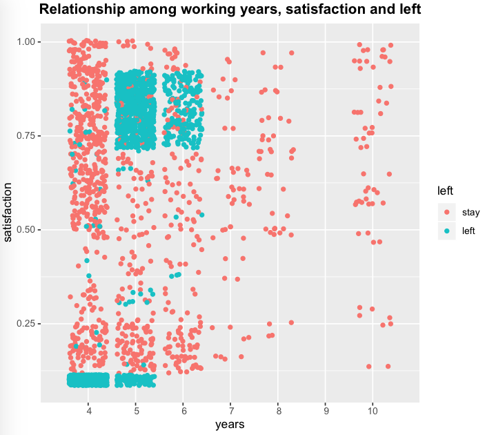
Conclusion:
```
(1)
(2)
(3)
```
3.5 View the relationship among department, projects and left
```
ggplot(hr_good, aes(sales, fill=left))+geom_bar(position="fill")+facet_wrap(~factor(project), ncol=1) + theme3 + theme(axis.text.x=element_text(angle=270))+labs(x="departments", y="number project", title="Relationship among departments, projects and left")
```
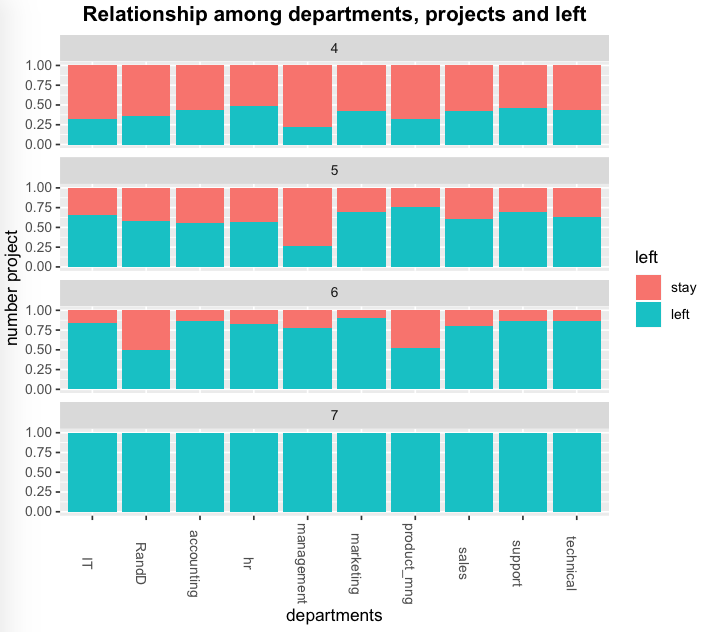
Conclusion:
```
(1)
```
3.6 View the relationship between department and left
```
ggplot(hr_good, aes(sales, fill=left))+geom_bar(position="dodge")+coord_flip()+scale_x_discrete(limits=c("management", "RandD", "hr", "accounting", "marketing", "product_mng", "IT", "support", "technical", "sales"))+labs(x="departments", title="Relationship between departments and left")
```
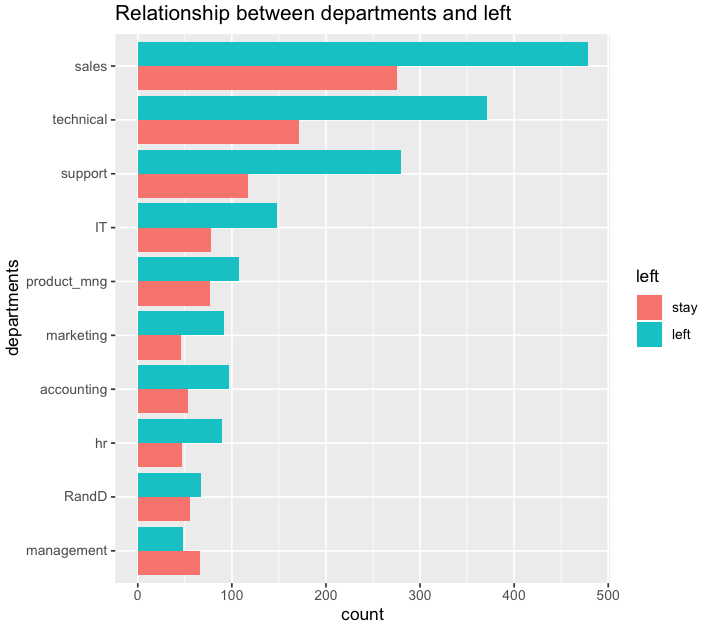
Conclusion:
```
(1)
```

## III. Build predicting model
Data Partition
```
library("lattice")
library("caret")
set.seed(0001)
train <- createDataPartition(hr_good$left, p=0.75, list=FALSE)
hr_good_train <- hr_good[train, ]
hr_good_test <- hr_good[-train, ]
```
### 1. Logistic regression

1.1 Build logistic regresson and verify
```
library("caTools")
ctrl <- trainControl(method="cv", number=5)
logit <- train(left~., hr_good_train, method="LogitBoost", trControl=ctrl)
logit.pred <- predict(logit, hr_good_test, type="raw")
confusionMatrix(hr_good_test$left, logit.pred)
```
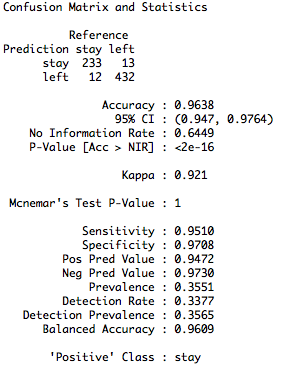

1.2 Evaluate model, draw ROC/AUC
```
library(“pROC”)
roc(as.numeric(hr_good_test$left), as.numeric(logit.pred), plot=TRUE, print.thres=TRUE, print.auc=TRUE, col="black")
```
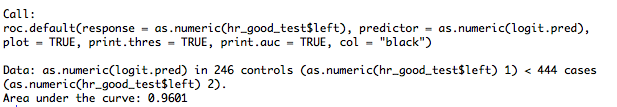
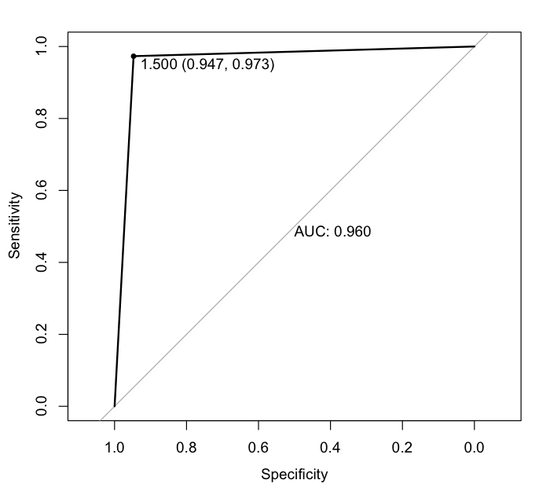

### 2. Decision Tree
2.1 Build decision tree
```
library("rpart")
library("partykit")
library("grid")
dtree <- rpart(left~., hr_good_train, method="class", parms=list(split="information"))
dtree$cptable
```
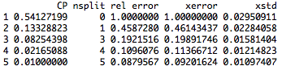
```
plotcp(dtree)
```
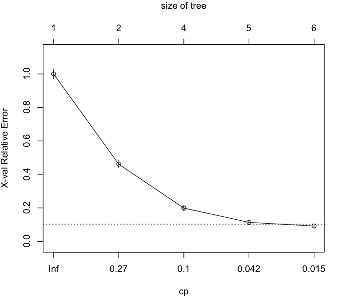
```
dtree.pruned <- prune(dtree, cp=0.01)
plot(as.party(dtree.pruned), main="Decision Tree")
```
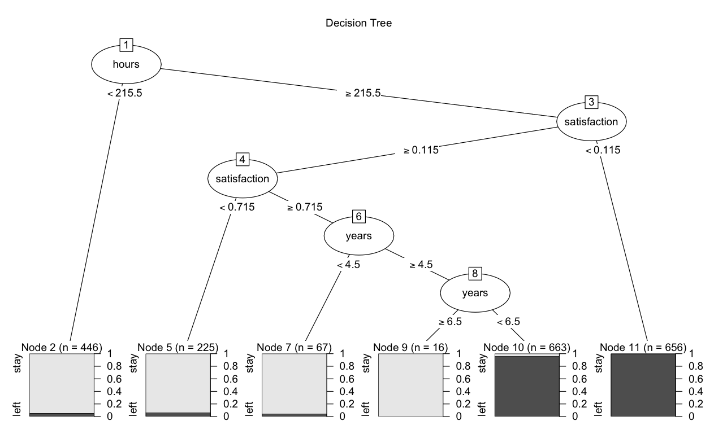
```
dtree.pruned.pred <- predict(dtree.pruned, hr_good_test, type="class")
confusionMatrix(hr_good_test$left, dtree.pruned.pred)
```
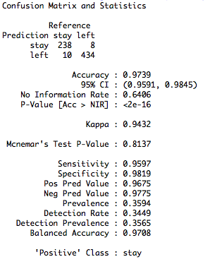
2.2 Evaluate model, draw ROC/AUC
```
roc(as.numeric(hr_good_test$left), as.numeric(dtree.pruned.pred), plot=TRUE, print.thres=TRUE, print.auc=TRUE, col="blue")
```
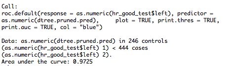
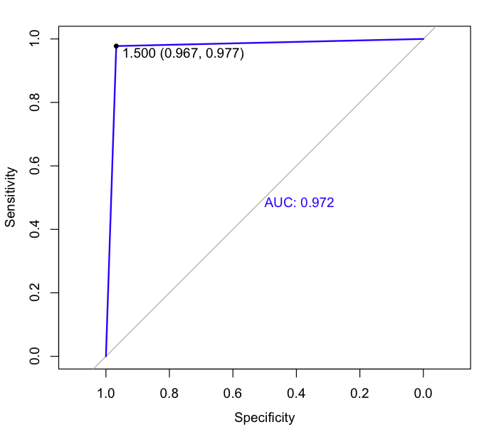

### 3. Random forest
3.1 Build random forest
```
library("randomForest")
set.seed(0002)
forest <- randomForest(left~., hr_good_train, importance=TRUE, na.action=na.roughfix)
forest
```
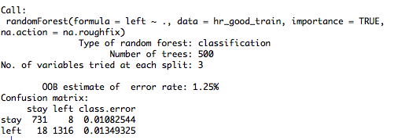
```
importance(forest, type=2)
```
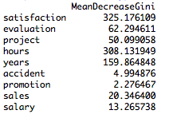
```
forest.pred <- predict(forest, hr_good_test)
confusionMatrix(hr_good_test$left, forest.pred)
```
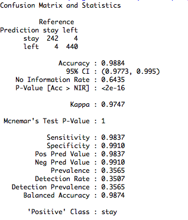
3.2 Evaluate model, draw ROC/AUC
```
roc(as.numeric(hr_good_test$left), as.numeric(forest.pred), plot=TRUE, print.thres=TRUE, print.auc=T, col="green")
```
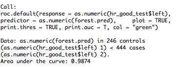
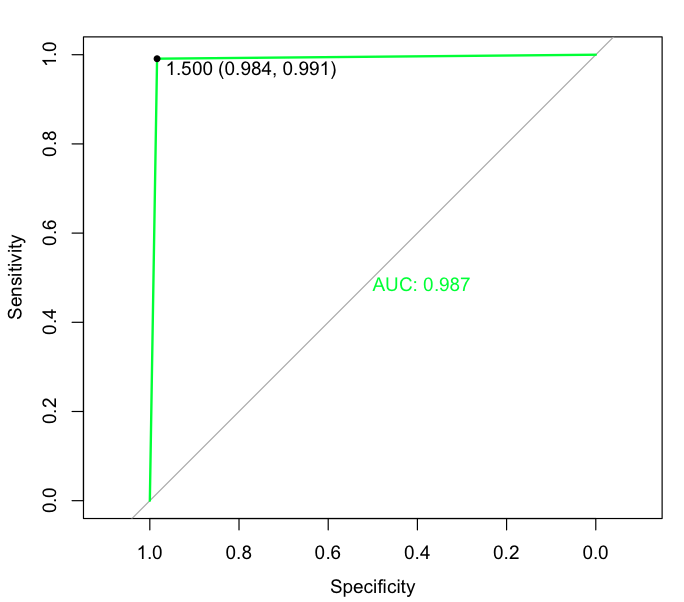

### 4. SVM
4.1 Build SVM
```
library("e1071")
set.seed(0003)
svm <- svm(left~., hr_good_train)
svm.pred <- predict(svm, na.omit(hr_good_test))
confusionMatrix(na.omit(hr_good_test)$left, svm.pred)
```
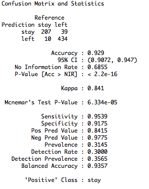
4.2 Evaluate model, draw ROC/AUC
```
roc(as.numeric(na.omit(hr_good_test)$left), as.numeric(svm.pred), plot=T, print.thres=T, print.auc=T, col="orange")
```
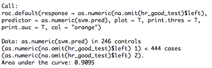
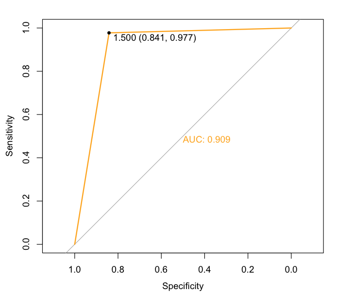

### 5. Compare models, choose the most accurate model
```
roc(as.numeric(hr_good_test$left), as.numeric(logit.pred), plot=TRUE, col="black", main=paste("ROC:", "Logitis(black)", "dtree(blue)", "randomForest(green)", "SVM(orange)", sep=""))
roc(as.numeric(hr_good_test$left), as.numeric(dtree.pruned.pred), plot=TRUE, col="blue", add=T)
roc(as.numeric(hr_good_test$left), as.numeric(forest.pred), plot=TRUE, col="green", add=T)
roc(as.numeric(hr_good_test$left), as.numeric(svm.pred), plot=TRUE, col="orange", add=T)
```
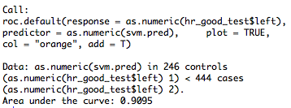
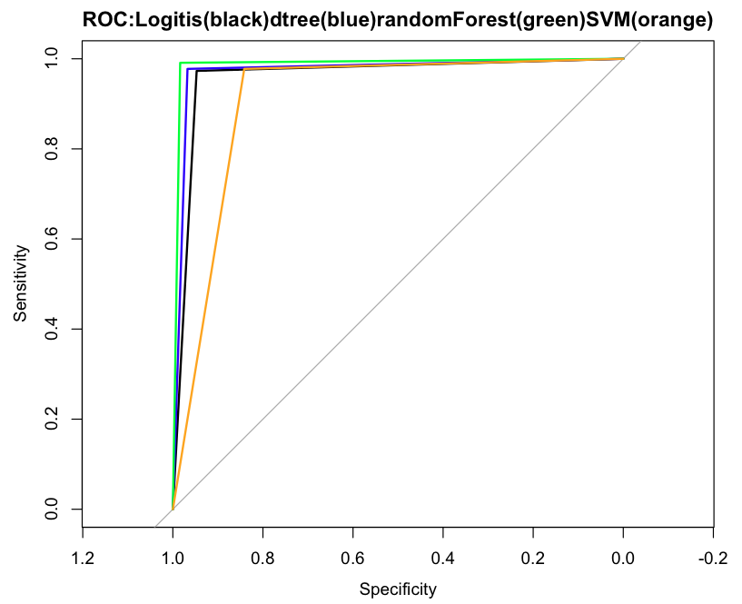
Conclusion:
```
(1)
```
### 6. Apply model
```
importance(forest, type=2)
```
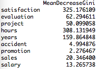
6.1 Remove unimportant factors, rebuild the model
```
forest2 <- randomForest(left~.-promotion-accident-salary-sales, hr_good, na.action=na.roughfix, importance=TRUE)
importance(forest2, type=2)
```
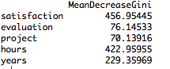
```
forest2.pred <- predict(forest2, hr_good_test)
confusionMatrix(hr_good_test$left, forest2.pred, positive="left")
```
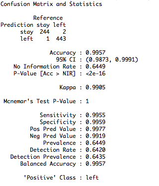
6.2 Evaluate model, draw ROC/AUC
```
roc(as.numeric(hr_good_test$left), as.numeric(forest2.pred), plot=TRUE, print.thres=T, print.auc=T, main="Random Forest", col="green")
```
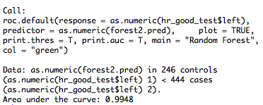
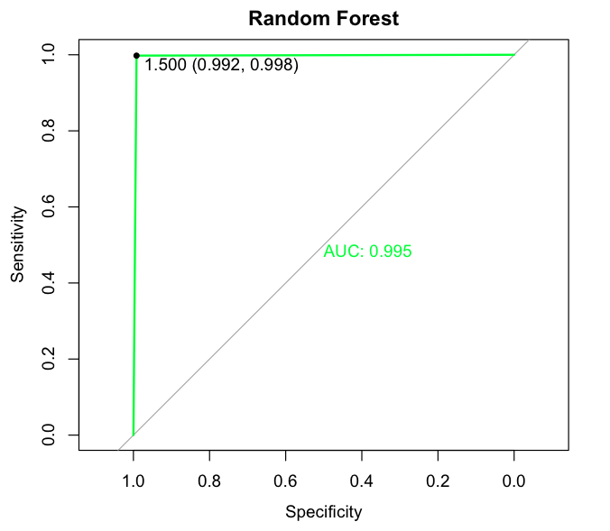

### 7. Conclusion
```
1.
2.
3.
```

* * *

JS
<script>document.write(5 + 6);</script>


[BACK](./)
