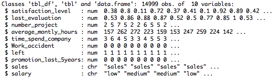
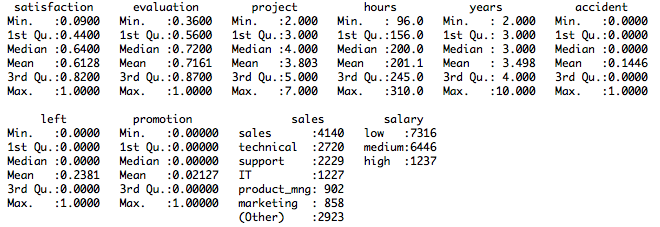
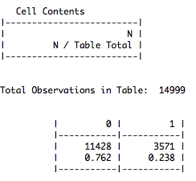
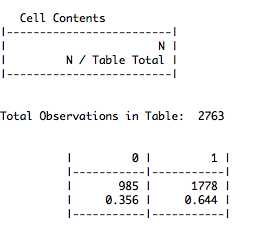
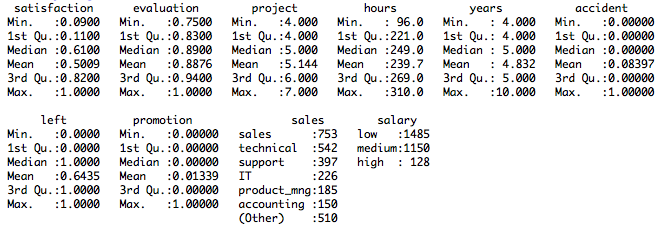
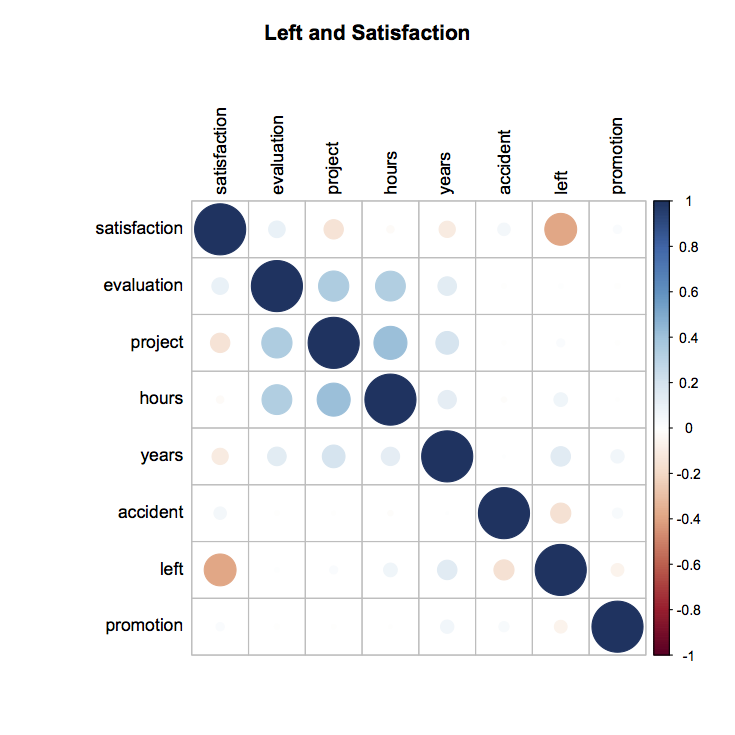

[BACK](./)

Reference:

1. [https://chf2012.github.io/2017/01/30/数据分析/20_数据分析/专题分析/优秀员工离职原因分析与预测/](https://chf2012.github.io/2017/01/30/数据分析/20_数据分析/专题分析/优秀员工离职原因分析与预测/)
2. [https://blog.csdn.net/qq_20408903/article/details/80628331](https://blog.csdn.net/qq_20408903/article/details/80628331)
3. [https://blog.csdn.net/wanglingli95/article/details/79435976](https://blog.csdn.net/wanglingli95/article/details/79435976)
4. [https://blog.csdn.net/Cocaine_bai/article/details/80749588](https://blog.csdn.net/Cocaine_bai/article/details/80749588)
5. [https://blog.csdn.net/Cocaine_bai/article/details/80758636](https://blog.csdn.net/Cocaine_bai/article/details/80758636)

## I. Background

1. Plenty of excellent and experienced employee resign ahead of expected.

1. Data source: kaggle

1. Objects and measurement
(1) Analyze what is the possible reasons the employee resign
(2) Build the predicting model and predict which excellent employee will be the next to resign

1. Variable

```
satisfaction: employee satisfaction level
evaluation: last evaluation
project: number of projects
hours: average monthly hours
years: time spent at the company
accident: whether they have had a work accident
promotion: whether they have had a promotion in the last 5 years
sales: department
salary: salary
left: whether the employee has left
```

## II. Data Analysis

Libraries

```
library(readr)
library(dplyr)
library(ggplot2)
library(gmodels)
```

### 1. Import Data and view

1.1 Import data

```
hr <- read_csv("HR_comma_sep.csv")
hr <- tbl_df(hr)
View(hr)
str(hr)
```


1.2 Rename variables

```
colnames(hr) <- c("satisfaction", "evaluation", "project", "hours", "years", "accident", "left", "promotion", "sales", "salary")
```

1.3 Factor

```
hr$sales <- factor(hr$sales)
hr$salary <- factor(hr$salary, levels=c("low", "medium", "high"))
```

1.4 View data

```
sum(is.na(hr))
```
#[1] 0

```
summary(hr)
```


### 2. Based on assumption, choose the subset of excellent employees
Excellent employee:
(1) evaludation >= 0.75
(2) project >= 4
(3) year >= 4

2.1 filter subset based on assumption

```
hr_good <- filter(hr, evaluation>=0.75 & years>=4 & project>=4)
```

2.2 Compare left employee from subset with overall
```
CrossTable(hr$left)
```


```
CrossTable(hr_good$left)
```


Conclusion:
(1) from overall left employees, excellent employee percentage = 1778/3571 = 50%
(2) from excellent employees subset, the left percentage = 1778/2763 = 64%

2.3 view excellent employee subset

```
summary(hr_good)
```


2.4 View the correlationship among the variables in excellent employees subset

```
library("corrplot")
hr_good_corr <- select(hr, -sales, -salary) %>% cor()
corrplot(hr_good_corr, method="circle", tl.col="black", title="Left and Satisfaction", mar=c(1,1,3,1))
```


Conclusion: 
(1) Left has negative correlationship with satisfaction, and high correlated.


```js
// Javascript code with syntax highlighting.
var fun = function lang(l) {
  dateformat.i18n = require('./lang/' + l)
  return true;
}
```

```ruby
# Ruby code with syntax highlighting
GitHubPages::Dependencies.gems.each do |gem, version|
  s.add_dependency(gem, "= #{version}")
end
```

#### Header 4

*   This is an unordered list following a header.
*   This is an unordered list following a header.
*   This is an unordered list following a header.

##### Header 5

1.  This is an ordered list following a header.
2.  This is an ordered list following a header.
3.  This is an ordered list following a header.

###### Header 6

| head1        | head two          | three |
|:-------------|:------------------|:------|
| ok           | good swedish fish | nice  |
| out of stock | good and plenty   | nice  |
| ok           | good `oreos`      | hmm   |
| ok           | good `zoute` drop | yumm  |

### There's a horizontal rule below this.

* * *

### Here is an unordered list:

*   Item foo
*   Item bar
*   Item baz
*   Item zip

### And an ordered list:

1.  Item one
1.  Item two
1.  Item three
1.  Item four

### And a nested list:

- level 1 item
  - level 2 item
  - level 2 item
    - level 3 item
    - level 3 item
- level 1 item
  - level 2 item
  - level 2 item
  - level 2 item
- level 1 item
  - level 2 item
  - level 2 item
- level 1 item

### Small image


### Large image


### Definition lists can be used with HTML syntax.

<dl>
<dt>Name</dt>
<dd>Godzilla</dd>
<dt>Born</dt>
<dd>1952</dd>
<dt>Birthplace</dt>
<dd>Japan</dd>
<dt>Color</dt>
<dd>Green</dd>
</dl>

```
Long, single-line code blocks should not wrap. They should horizontally scroll if they are too long. This line should be long enough to demonstrate this.
```

```
The final element.
```

[BACK](./)
